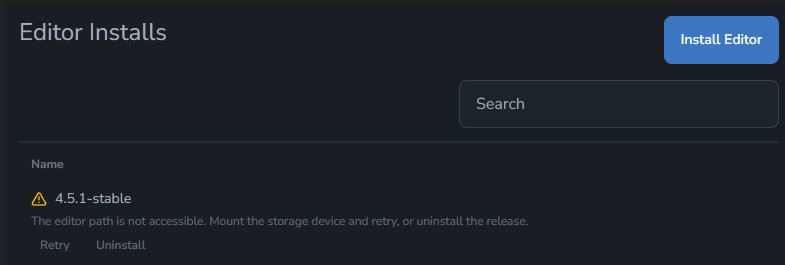

Godot Launcher 1.6.0 keeps your projects and tools in lockstep. Automatic editor syncing now updates VS Code and Godot settings whenever you import a project or switch releases, while smarter validation catches disappearing installs before they interrupt your day. You can also toggle VS Code integration and bootstrap Git straight from a project’s overflow menu, so getting started (or recovering from a tooling change) takes just a few clicks.

<!-- truncate -->

## Projects stay in sync automatically

When you add a project or change its assigned editor, the launcher now keeps Godot editor settings and `.vscode` workspace files aligned with the release you chose. Custom settings stay intact and new settings are merged into existing configuration rather than overwriting it, and Mono projects pick up the right launch/task templates without manual edits.

## The launcher keeps pace with your filesystem

Editors that go missing after a rename, move, or uninstall are now flagged almost immediately. A new focus listener and five-minute background revalidation rerun the same checks the installer uses, so Installs and Projects views always reflect what’s really on disk. Broken releases show Retry and Remove actions right in the UI, and projects bound to invalid editors show an inline warning that point you toward a fix before launch time.

## Toggle VS Code and Git without leaving the launcher

Every project menu now exposes VS Code and Git controls that respect the tools you actually have installed. A cached discovery layer answers availability checks instantly, meaning the menu feels snappy even when you haven’t opened the Tools tab. Enable VS Code to regenerate editor settings, workspace recommendations, and Mono-ready debug profiles; initialize Git to run `git init`, and reveal fresh badges and tooltips in the project grid. All copy ships fully localised so every language gets the same streamlined flow.

## Upgrade to Godot Launcher 1.6.0 today

Update inside the app or grab the latest installer from the download page to try the new project tooling and resilience upgrades. If you juggle multiple releases, share workstations with a team, or lean on VS Code and Git, this release keeps everything in sync without extra maintenance.

## Related resources

- [Download Godot Launcher](/download/)
- [Report feedback or issues](https://github.com/godotlauncher/launcher/issues/new/choose)
- [Join the community discussions](/community/)
- [Visit the documentation pages](https://docs.godotlauncher.org)
